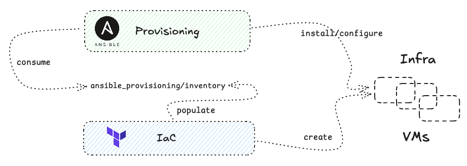

# on-prem-laughing-giggle: setup k8s on-prem-ish infra
Stack: Terraform/Ansible/Azure

## Infra Prerequisites:

* When creating VMs, you can create a virtual network or **use an existing one**.
* A network interface (NIC) is the interconnection between a VM and a VNet. You can assign Public or Private IP addresses. Each NIC must be connected to a VNet that exists in the same Azure location and subscription as the NIC
  * Public IP addresses - Used to communicate inbound and outbound (WHITHOUT NAT)

* Full network connectivity among all machines in the cluster (either a public or a private network)
* Ensure both VMs have internal networking enabled and can communicate with each other (same network, and ensure firewall rules allow required ports).

## Setup:

## Steps:

* Terraform create infra [doc](https://github.com/dejanu/on-prem-laughing-giggle/blob/main/IaC/azure_terraform/readme.md)
* Ansible provision infra [doc](https://github.com/dejanu/on-prem-laughing-giggle/blob/main/IaC/azure_terraform/readme.md)

## Resources:

* Azure doc for [provider](https://registry.terraform.io/providers/hashicorp/azurerm/latest/docs)

* Azure Structure: Subscription -> ResourceGroup -> [VNet](https://registry.terraform.io/providers/hashicorp/azurerm/latest/docs#example-usage) -> [Subnet](https://registry.terraform.io/providers/hashicorp/azurerm/latest/docs/resources/subnet)

* VNet [network overview](https://learn.microsoft.com/en-us/azure/virtual-network/network-overview)

